客户端使用说明书
===========
### MacOS使用说明
#### 用户token配置
* 下载perf_desktop客户端
* 双击打开后会提示不受信任的程序，打开设置-安全-允许打开此应用
* 在客户端界面右上角点击用户头像
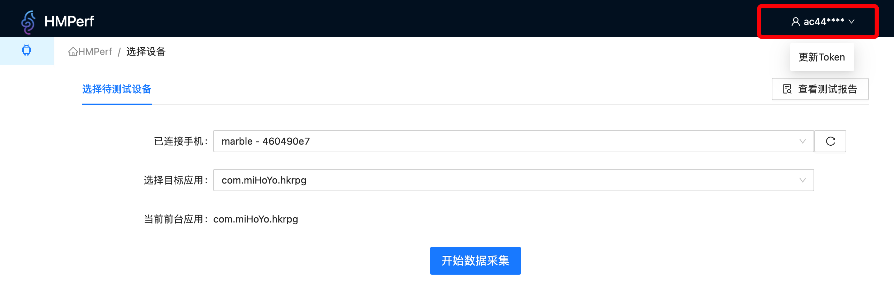
* 输入token
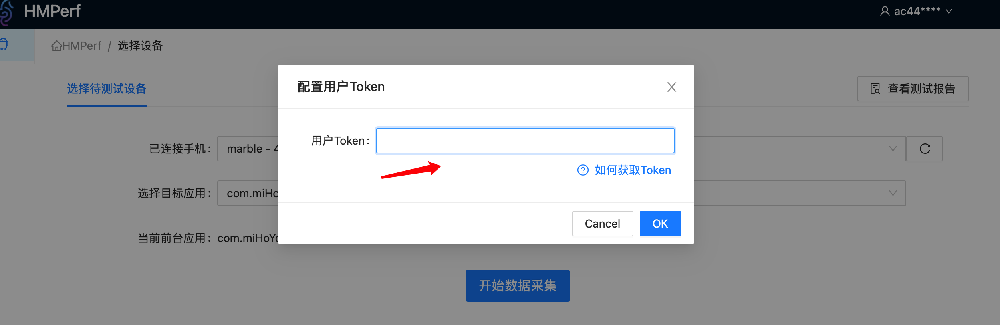

#### 测试Android设备
* 如果电脑已经连接手机，此时客户端界面上已经出现连接的设备devices-id和正在运行的应用包名
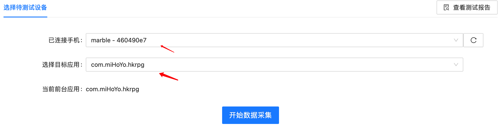
* 点击开始采集数据后，确认采集的设备信息和应用信息无误，点击开始执行
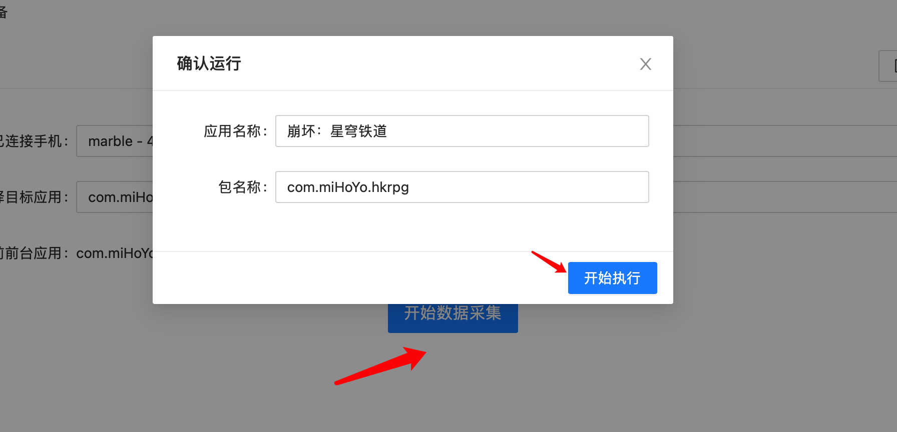
* 点击开始执行后，客户端可实时显示当前正在运行的手机APP性能信息
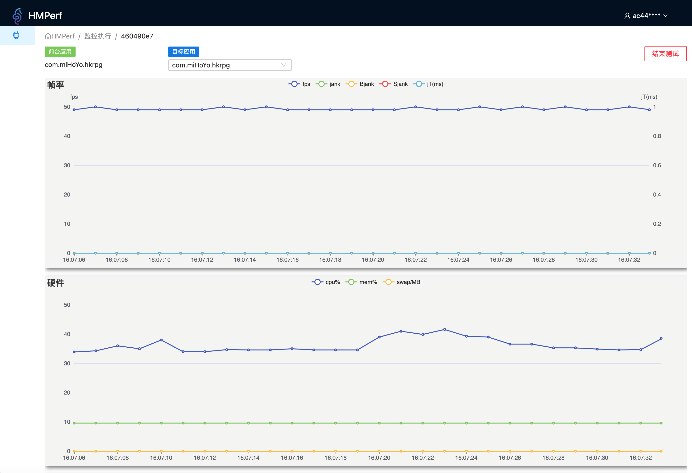
* 点击右上角结束测试按钮，停止数据采集
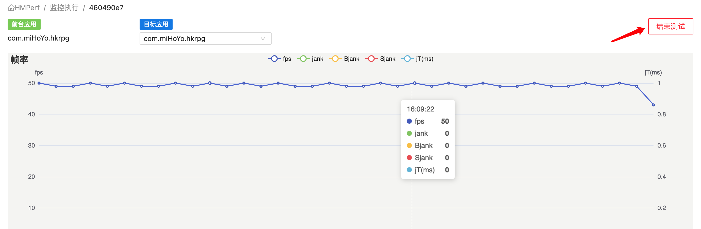
* 点击上传测试报告，输入本次测试的信息后，点击上传报告，本次测试的数据即可上传web平台
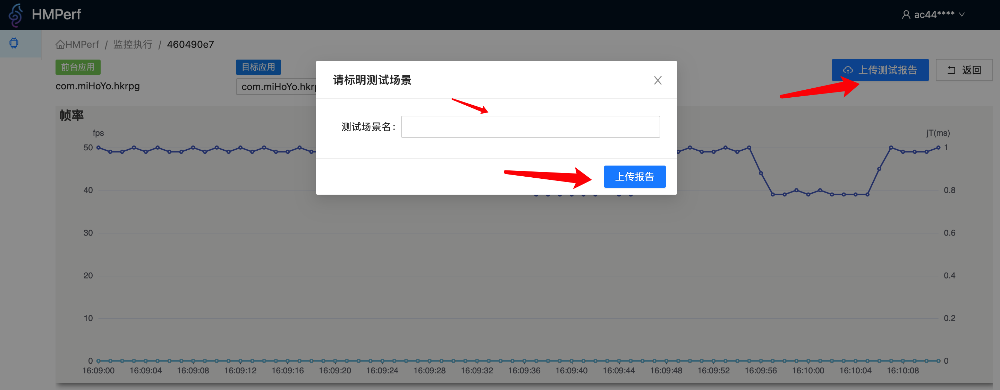
* 返回客户端主页面后，点击右上角查看测试报告，可直接跳转web平台查看测试信息
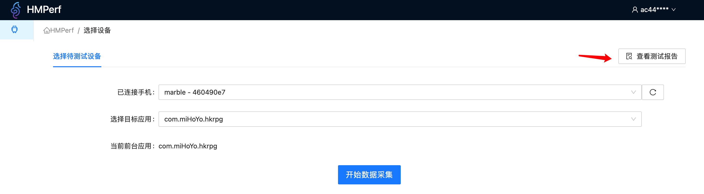

#### 测试iOS设备(ios系统17以下)
* iPhone手机连接电脑选择信任该设备，此时在客户端界面点击iPhone选项，设备显示框内会显示已连接的iPhone手机
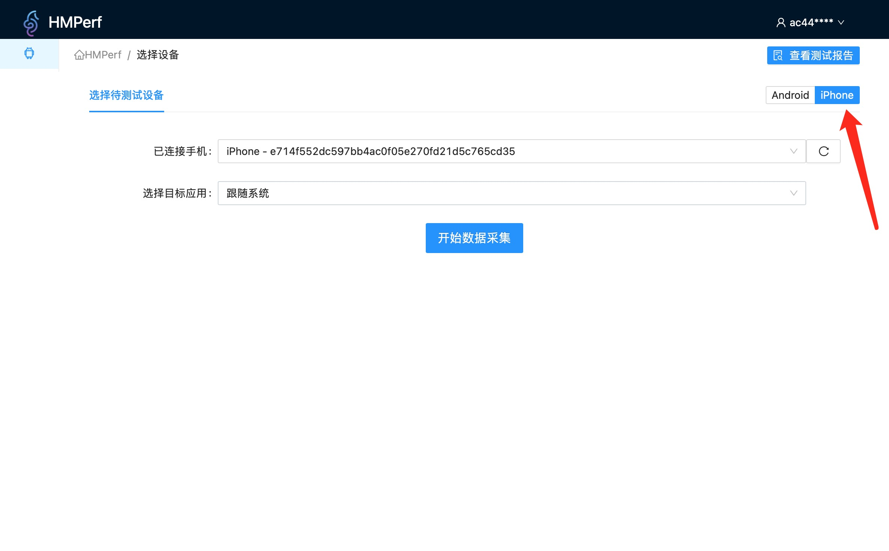
* “选择目标应用” 选择默认跟随系统即可
* 点击开始采集数据，点击开始执行
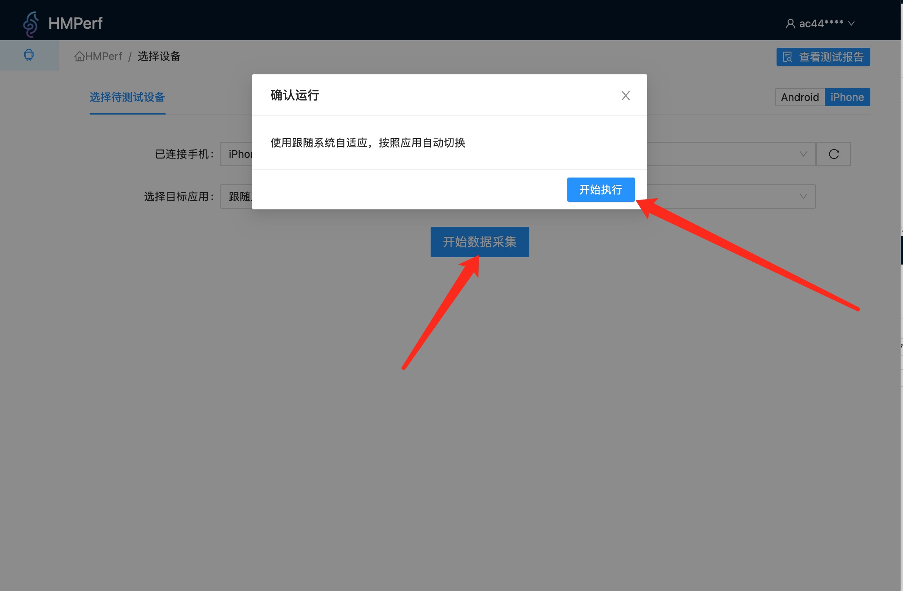
* 点击开始执行后，客户端可实时显示当前正在运行的手机APP性能信息
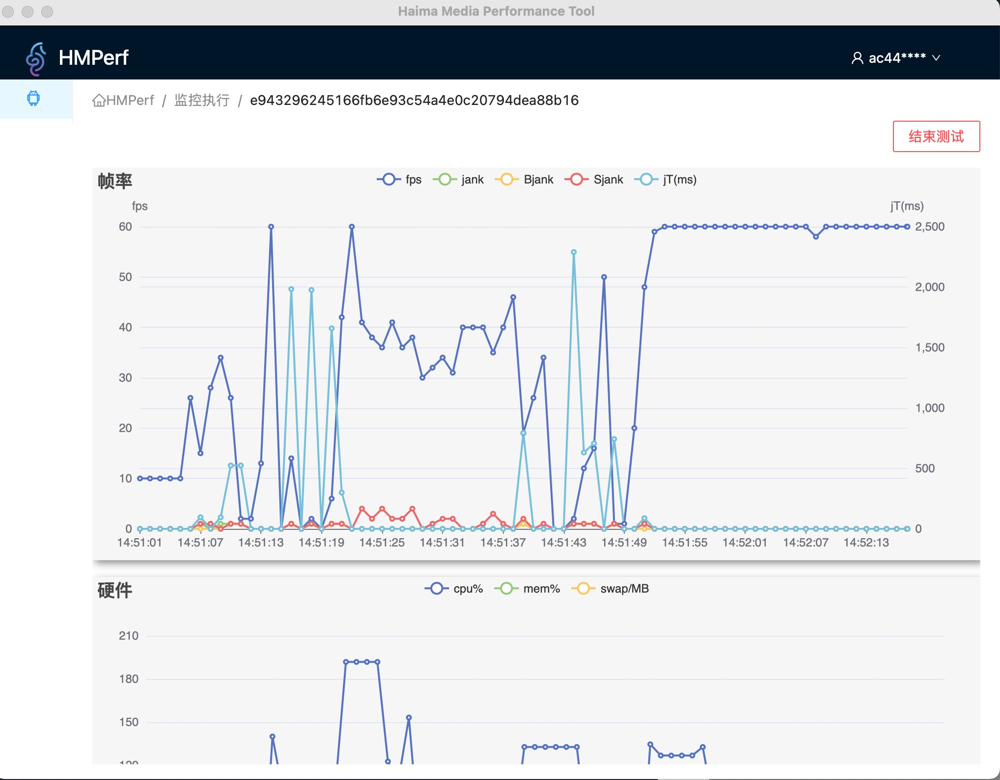
* 点击右上角结束测试按钮，停止数据采集
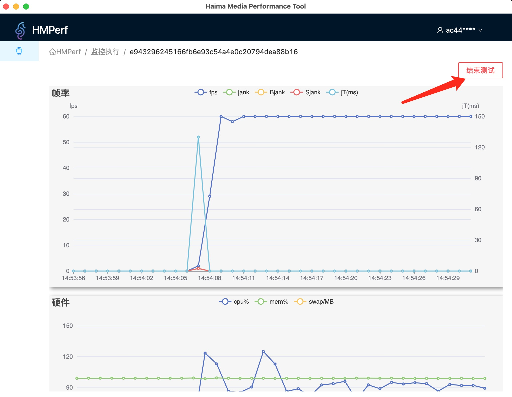
* 点击上传测试报告，输入本次测试的信息后，点击上传报告，本次测试的数据即可上传web平台
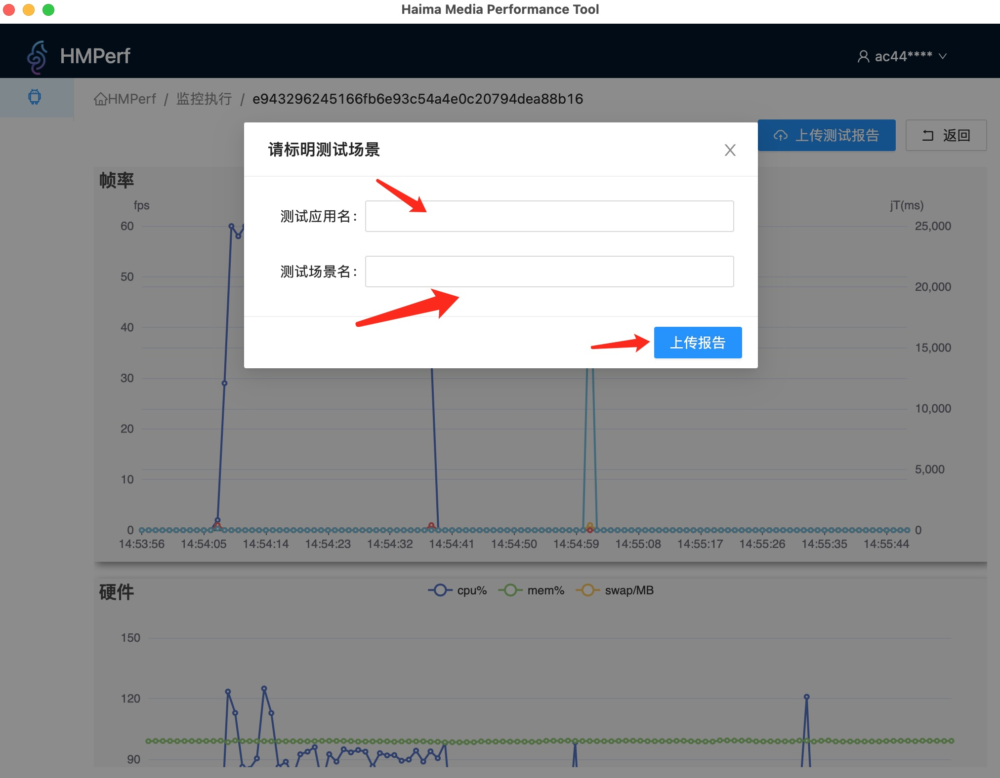

#### 测试iOS设备(ios17系统)
* 在开始进行测试之前，需要执行sudo python ios17_master.py文件
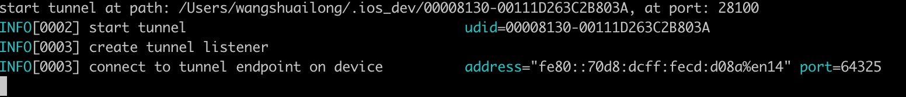
* 执行成功后，就可以正常采集数据

### win使用说明
* win系统使用方法和mac系统使用一致，如果在win系统无法正常打开perf_desktop客户端，可以尝试使用管理员运行的方式打开perf_desktop客户端

